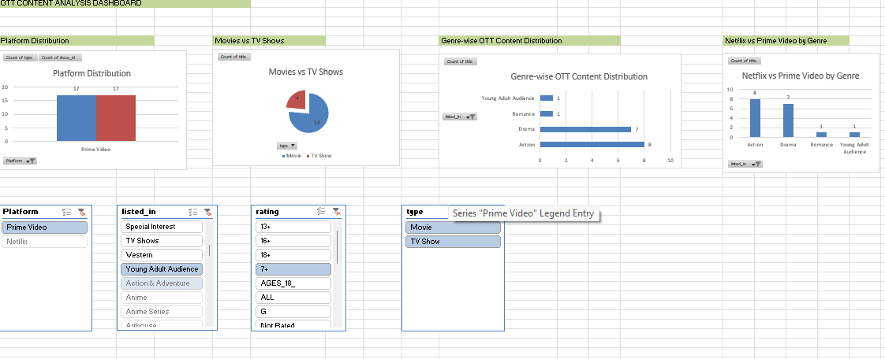
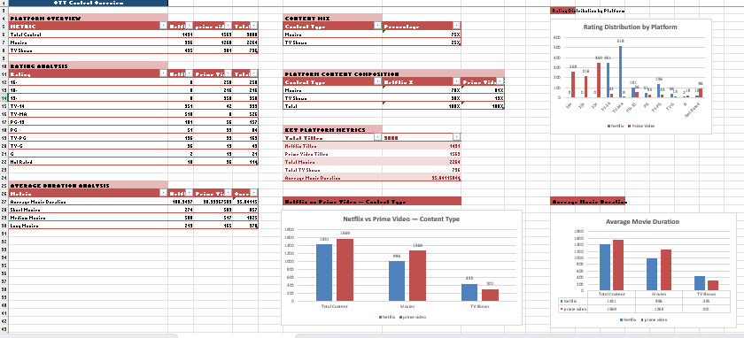
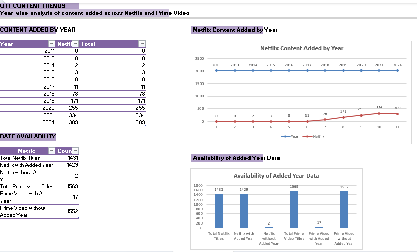
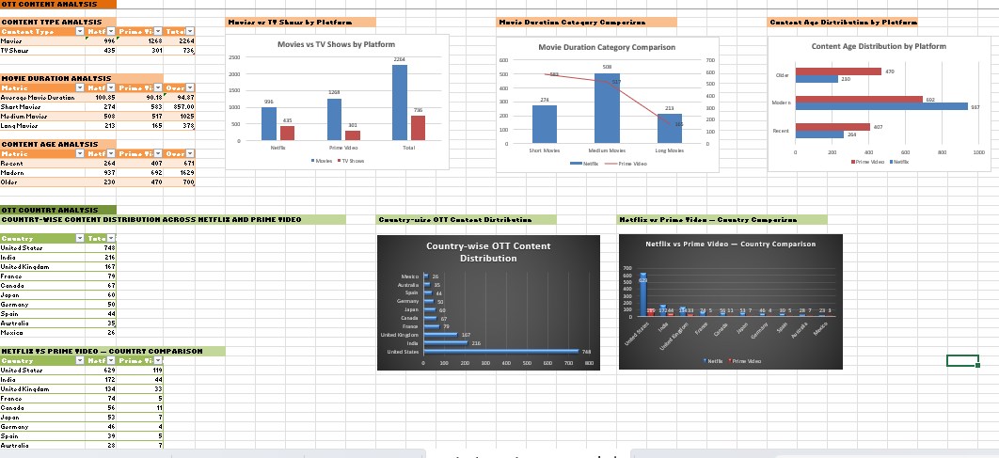
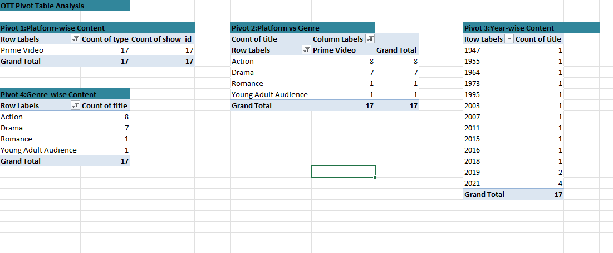

# OTT Platform Content Trend Analysis

An Excel-based data analytics project exploring OTT content trends across Netflix and Prime Video.

The project covers data cleaning, transformation, feature engineering, pivot table analysis, data visualization, and dashboard development using Microsoft Excel.

### Project Objective

The objective of this project is to analyze OTT content data and identify patterns related to:

- Platform-wise content distribution
- Movies vs. TV Shows
- Genre distribution
- Country-wise content
- Content ratings
- Movie duration
- Content age
- Content addition trends
- Netflix vs. Prime Video

### Dataset

The dataset contains 3,000 OTT content records across Netflix and Prime Video.

| Metric | Value |
|---|---:|
| Total Content | 3,000 |
| Netflix Content | 1,431 |
| Prime Video Content | 1,569 |
| Movies | 2,264 |
| TV Shows | 736 |
| Average Movie Duration | 95.04 minutes |
| Drama Titles | 656 |
| Comedy Titles | 533 |
| Action Titles | 421 |
| United States Titles | 748 |
| India Titles | 216 |

### Tools and Technologies

- Microsoft Excel
- Excel Formulas
- Pivot Tables
- Data Cleaning and Transformation
- Feature Engineering
- Data Analysis
- Data Visualization
- Dashboard Development

### Project Workflow

Raw Data → Data Cleaning → Data Transformation → Feature Engineering → Pivot Table Analysis → Data Visualization → Dashboard → Business Insights

### Data Cleaning and Transformation

The dataset was prepared in Microsoft Excel before analysis.

Key activities included:

- Cleaning and standardizing data
- Handling missing values
- Performing data quality checks
- Creating platform identifiers
- Extracting year and month information
- Creating content age categories
- Categorizing movie duration
- Preparing data for pivot table analysis

### Analysis Performed

**Platform-wise Content Analysis**

Compared the content libraries of Netflix and Prime Video.

- Netflix: 1,431 titles
- Prime Video: 1,569 titles

**Movies vs. TV Shows**

Analyzed the distribution of movies and TV shows across the platforms.

- Movies: 2,264
- TV Shows: 736

**Genre Analysis**

Analyzed content distribution across major genres, including Drama, Comedy, Action, Animation, Horror, Family, Documentary, Crime, Romance, and Thriller.

Drama is the largest genre with 656 titles, followed by Comedy with 533 titles and Action with 421 titles.

**Country Analysis**

Analyzed content distribution across countries.

- United States: 748 titles
- India: 216 titles
- United Kingdom: 167 titles
- France: 79 titles
- Canada: 67 titles
- Japan: 60 titles
- Germany: 50 titles

**Movie Duration Analysis**

Compared movie duration across the platforms.

- Overall average: approximately 95 minutes
- Netflix average: approximately 101 minutes
- Prime Video average: approximately 90 minutes

**Content Age Analysis**

Analyzed content by release year to understand the distribution of newer and older titles.

**Content Addition Trends**

Performed year-wise analysis to explore changes in OTT content volume over time.

The dataset shows an increase in content during the late 2010s and around 2020–2021. Year-based comparisons should be interpreted with care because date-added information is more complete for Netflix than for Prime Video.

### Dashboard Preview

### Analysis Screenshots

**Content Overview**

**Content Trends**

**Country and Genre Analysis**

**Pivot Table Analysis**

**Final Dashboard**

### Key Business Insights

- Prime Video contains 1,569 titles, compared with 1,431 Netflix titles in the dataset.
- Movies account for 2,264 titles, making them the dominant content type.
- Drama is the largest genre with 656 titles.
- Comedy contains 533 titles, followed by Action with 421 titles.
- The United States is the most represented country, with 748 titles.
- India is the second most represented country, with 216 titles.
- Netflix movies average approximately 101 minutes, compared with approximately 90 minutes for Prime Video.
- Content volume increased during the late 2010s and around 2020–2021.

### Project Files

| File | Description |
|---|---|
| `Dharani_OTT_Platform_Content_Trend_Analysis_Starter(1).xlsx` | Excel analysis workbook |
| `OTT_Content_Cleaned_3000_Rows.xlsx` | Cleaned OTT dataset |
| `Screenshot1.png` | Content Overview |
| `Screenshot2.png` | Content Trends |
| `Screenshot3.png` | Country and Genre Analysis |
| `Screenshot4.png` | Pivot Table Analysis |
| `Screenshot5.png` | Final Dashboard |
| `README.md` | Project documentation |

### Conclusion

This project demonstrates practical experience in Excel-based data analytics, including data cleaning, transformation, feature engineering, pivot table analysis, data visualization, and dashboard development.

It shows how raw OTT content data can be transformed into structured analysis and business insights across Netflix and Prime Video.